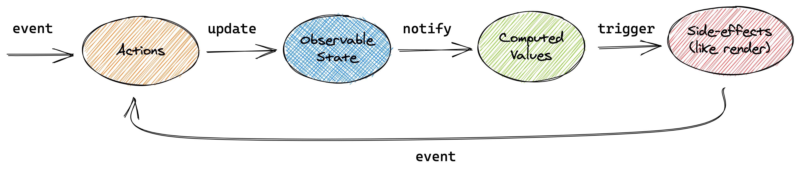

# MobX

_Simple, scalable state management_

[](https://github.com/mobxjs/mobx/discussions)
[](https://badge.fury.io/js/mobx)
[](#backers)
[](#sponsors)

---

MobX is made possible by the generosity of the sponsors below, and many [individual backers](http://mobxjs.github.io/mobx/backers-sponsors.html#backers). Sponsoring directly impacts the longevity of this project.

**🥇Gold sponsors (\$3000+ total contribution):** <br/>
<a href="https://mendix.com/"></a>
<a href="https://frontendmasters.com/"></a>
<a href="https://opensource.facebook.com/"></a>
<a href="http://auctionfrontier.com/"></a>
<a href="https://www.guilded.gg/"></a>
<a href="https://coinbase.com/"></a>
<a href="https://www.canva.com/"></a>

**🥈Silver sponsors (\$100+ pm):**<br/>
<a href="https://mantro.net/jobs/warlock"></a>
<a href="https://www.codefirst.co.uk/"></a>
<a href="https://www.dcslsoftware.com/"></a>
<a href="https://www.bugsnag.com/platforms/react-error-reporting?utm_source=MobX&utm_medium=Website&utm_content=open-source&utm_campaign=2019-community&utm_term=20190913"></a>
<a href="https://curology.com/blog/tech"></a>

**🥉Bronze sponsors (\$500+ total contributions):**<br/>
<a href="https://www.algolia.com/"></a>
<a href="https://talentplot.com/"></a>
<a href="https://careers.dazn.com/"></a>
<a href="https://blokt.com/"></a>

---

## Introduction

_Anything that can be derived from the application state, should be derived. Automatically._

MobX is a battle tested library that makes state management simple and scalable by transparently applying functional reactive programming (TFRP).
The philosophy behind MobX is simple:

<div class="benefits">
    <div>
        <div class="pic">😙</div>
        <div>
            <h5>Straightforward</h5>
            <p>With MobX, you write minimalistic, boilerplate free code that captures your intent:
            Trying to update a record field? Use good old JavaScript assignment.
            Updating data in an asynchronous process? No special tools are required.
            The reactivity system will detect all your changes and propagate them out to where they are being used.
            </p>
        </div>
    </div>
    <div>
        <div class="pic">🚅</div>
        <div>
            <h5>Effortless optimal rendering</h5>
            <p>
                MobX tracks all updates and usages of your data at runtime, building a dependency tree that captures all relations between state and output.
                This guarantees that computations depending on your state, like React components, run only when strictly needed.
                With MobX, there is no need to manually optimize components using error-prone and sub-optimal techniques like memoization and selectors.
            </p>
        </div>
    </div>
    <div>
        <div class="pic">🤹🏻‍♂️</div>
        <div>
            <h5>Architectural freedom</h5>
            <p>
                MobX is unopinionated and allows you to manage your application state outside of any UI framework.
                This makes your code decoupled, portable, and above all, easily testable.
            </p>
        </div>
    </div>
</div>

## A quick example

So what does code that uses MobX look like?

```javascript
import React from "react"
import ReactDOM from "react-dom"
import { makeAutoObservable } from "mobx"
import { observer } from "mobx-react"

// Model the application state
class Timer {
    secondsPassed = 0

    constructor() {
        makeAutoObservable(this)
    }

    increaseTimer() {
        this.secondsPassed += 1
    }

    resetTimer() {
        this.secondsPassed = 0
    }
}

const myTimer = new Timer()

// Build a user interface for this app, that merely uses the state...
const TimerView = observer(({ timer }) => (
    <button onClick={() => timer.resetTimer()}>Seconds passed: {timer.secondsPassed}</button>
))

ReactDOM.render(<TimerView timer={myTimer} />, document.body)

// For demo's sake, let's force some updates...
setInterval(() => {
    myTimer.increaseTimer()
}, 1000)
```

The `observer` wrapper around the `TimerView` React component will automatically detect that rendering
of the component depends on `timer.secondsPassed`, even though this relationship is not explicitly defined. MobX's reactivity system will make sure the component gets re-rendered when _precisely that_ field is updated in the future.

Every event (`onClick` and `setInterval`) invokes an _action_ (`increaseTimer` and `resetTimer` functions) that updates _observable state_ (`secondsPassed` class property).
Changes in the observable state are propagated precisely to all _computations_ and _side effects_ (`TimerView` component) that depend on the changes being made.



You can apply this diagram as a conceptual picture to this simple example or any other application using MobX.

To learn about the core concepts of MobX with a larger example, please read [Concepts & Principles](http://mobxjs.github.io/mobx/intro/concepts.html) or take the [10 minute interactive introduction to MobX and React](https://mobx.js.org/getting-started).
The philosophy and benefits of the mental model provided by MobX are described in detail in the blogs [UI as an afterthought](https://michel.codes/blogs/ui-as-an-afterthought) and [How to decouple state and UI (a.k.a. you don’t need componentWillMount)](https://hackernoon.com/how-to-decouple-state-and-ui-a-k-a-you-dont-need-componentwillmount-cc90b787aa37).

## What others are saying...

> Guise, #mobx isn't pubsub, or your grandpa's observer pattern. Nay, it is a carefully orchestrated observable dimensional portal fueled by the power cosmic. It doesn't do change detection, it's actually a level 20 psionic with soul knife, slashing your viewmodel into submission.

> After using #mobx for lone projects for a few weeks, it feels awesome to introduce it to the team. Time: 1/2, Fun: 2X

> Working with #mobx is basically a continuous loop of me going “this is way too simple, it definitely won’t work” only to be proven wrong

> I have built big apps with MobX already and comparing to the one before that which was using Redux, it is simpler to read and much easier to reason about.

> The #mobx is the way I always want things to be! It's really surprising simple and fast! Totally awesome! Don't miss it!

## Further resources and documentation

-   [Ten minute, interactive MobX + React tutorial](https://mobx.js.org/getting-started)
-   <i><a style="color: white; background:green;padding:5px;margin:5px;border-radius:2px" href="https://egghead.io/courses/manage-complex-state-in-react-apps-with-mobx">egghead.io course</a></i> (Based on MobX 3)
-    [The MobX book](https://books.google.nl/books?id=ALFmDwAAQBAJ&pg=PP1&lpg=PP1&dq=michel+weststrate+mobx+quick+start+guide:+supercharge+the+client+state+in+your+react+apps+with+mobx&source=bl&ots=D460fxti0F&sig=ivDGTxsPNwlOjLHrpKF1nweZFl8&hl=nl&sa=X&ved=2ahUKEwiwl8XO--ncAhWPmbQKHWOYBqIQ6AEwAnoECAkQAQ#v=onepage&q=michel%20weststrate%20mobx%20quick%20start%20guide%3A%20supercharge%20the%20client%20state%20in%20your%20react%20apps%20with%20mobx&f=false) by Pavan Podila and Michel Weststrate.
-   Videos:
    -   [Introduction to MobX & React in 2020](https://www.youtube.com/watch?v=pnhIJA64ByY) - 17m by Leigh Halliday.
    -   [ReactNext 2016: Real World MobX](https://www.youtube.com/watch?v=Aws40KOx90U) - 40m [slides](https://docs.google.com/presentation/d/1DrI6Hc2xIPTLBkfNH8YczOcPXQTOaCIcDESdyVfG_bE/edit?usp=sharing)
    -   [Practical React with MobX](https://www.youtube.com/watch?v=XGwuM_u7UeQ). In depth introduction and explanation to MobX and React by Matt Ruby on OpenSourceNorth (ES5 only) - 42m.
    -   [MobX and the unique symbiosis of predictability and speed](https://www.youtube.com/watch?v=NBYbBbjZeX4&list=PL8sJahqnzh8JJD7xahG5zXkjfM5GOgcPA&index=21&t=0s) - HolyJS 2019 conf, 59 min
    -   [Talk: State Management Is Easy, React Amsterdam 2016 conf](https://www.youtube.com/watch?v=ApmSsu3qnf0&feature=youtu.be) ([slides](https://speakerdeck.com/mweststrate/state-management-is-easy-introduction-to-mobx))
-   [MobX awesome list](https://github.com/mobxjs/awesome-mobx#awesome-mobx)

## Credits

MobX is inspired by reactive programming principles as found in spreadsheets. It is inspired by MVVM frameworks like in MeteorJS tracker, knockout and Vue.js. But MobX brings Transparent Functional Reactive Programming to the next level and provides a standalone implementation. It implements TFRP in a glitch-free, synchronous, predictable and efficient manner.

A ton of credits for [Mendix](https://github.com/mendix), for providing the flexibility and support to maintain MobX and the chance to proof the philosophy of MobX in a real, complex, performance critical applications.
