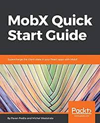

# MobX

_Simple, scalable state management_

[](https://circleci.com/gh/mobxjs/mobx)
[](https://coveralls.io/github/mobxjs/mobx?branch=master)
[](https://gitter.im/mobxjs/mobx?utm_source=badge&utm_medium=badge&utm_campaign=pr-badge&utm_content=badge)
[](https://hashnode.com/n/mobx)
[](#backers)
[](#sponsors)
[](https://github.com/prettier/prettier)

MobX is proudly sponsored by Mendix, Coinbase, Facebook Open Source, Canva, Algolia, Guilded, Auction Frontier, Mantro and TalentPlot for 100\$/month or more! And beyond that by many [individual backers](#backers) and through [one time contributions](https://github.com/mobxjs/mobx/blob/master/sponsors.md).

**🥇Gold sponsors (\$250+ pm):** <br/>
<a href="https://mendix.com/"></a>
<a href="http://auctionfrontier.com/"></a>

**🥈Silver sponsors (\$100+ pm):**<br/>
<a href="https://opensource.facebook.com/"></a>
<a href="https://www.canva.com/"></a>
<a href="https://www.guilded.gg/"></a>
<a href="https://mantro.net/jobs/warlock"></a>
<a href="https://www.codefirst.co.uk/"></a>
<a href="https://blokt.com/"></a>
<a href="https://www.bugsnag.com/platforms/react-error-reporting?utm_source=MobX&utm_medium=Website&utm_content=open-source&utm_campaign=2019-community&utm_term=20190913"></a>

**🥉Bronze sponsors (\$500+ total contributions):**<br/>
<a href="https://coinbase.com/"></a>
<a href="https://www.algolia.com/"></a>
<a href="https://talentplot.com/"></a>
<a href="https://frontendmasters.com/"></a>
<a href="https://careers.dazn.com/"></a>

# Installation

-   Installation: `npm install mobx --save`. React bindings: `npm install mobx-react --save`. To enable ESNext decorators (optional), see below.
-   CDN:
    -   https://unpkg.com/mobx/lib/mobx.umd.js
    -   https://cdnjs.com/libraries/mobx

_Tip: Consider using the faster and smaller ES6 build if targetting a modern environment: `lib/mobx.es6.js`. For example by setting up a webpack alias: `resolve: { alias: { mobx: __dirname + "/node_modules/mobx/lib/mobx.es6.js" }}`_

# Browser support

| MobX version | Actively supported | Supported browsers                                                                                                                                          | GitHub branch    |
| ------------ | ------------------ | ----------------------------------------------------------------------------------------------------------------------------------------------------------- | ---------------- |
| 5.\*         | Yes                | Any browser that supports [ES6 Proxies](https://kangax.github.io/compat-table/es6/#test-Proxy) (non polyfillable). _NOT:_ IE 11 and lower, Node 5 and lower | `master`         |
| 4.\*         | Yes (LTS)          | Any ES5 compliant browser                                                                                                                                   | `mobx4-master`   |
| 1-3.\*       | No                 | Any ES5 compliant browser                                                                                                                                   | No active branch |

-   All modern browsers are supported.
-   MobX >=5 runs on any browser with [ES6 proxy support](https://kangax.github.io/compat-table/es6/#test-Proxy). In practice this means:
    -   no Internet Explorer (Edge is fine)
    -   Node.js >= 6
-   React Native:
    -   iOS >= 10
    -   Android from RN 0.59 (or with manual JavaScript core [upgrade](https://github.com/react-community/jsc-android-buildscripts#how-to-use-it-with-my-react-native-app))
    -   Hermes runtime is [not supported](https://github.com/facebook/hermes/issues/28) (Use MobX 4 instead)
-   MobX 4 runs on any ES5 browser and will be actively maintained. The MobX 4 and 5 api's are the same and semantically can achieve the same, but MobX 4 has some [limitations](#mobx-4-vs-mobx-5).
-   The latest versions of libraries like mobx-react, mobx-react-lite, mobx-state-tree etc are kept compatible with both MobX 4 and 5.

## Translations

-   [中文](http://cn.mobx.js.org)

## Getting started

-   <i><a style="color: white; background:green;padding:5px;margin:5px;border-radius:2px" href="https://egghead.io/courses/manage-complex-state-in-react-apps-with-mobx">Egghead.io course</a></i>
-   [Ten minute, interactive MobX + React tutorial](https://mobxjs.github.io/mobx/getting-started)
-    [The MobX book](https://books.google.nl/books?id=ALFmDwAAQBAJ&pg=PP1&lpg=PP1&dq=michel+weststrate+mobx+quick+start+guide:+supercharge+the+client+state+in+your+react+apps+with+mobx&source=bl&ots=D460fxti0F&sig=ivDGTxsPNwlOjLHrpKF1nweZFl8&hl=nl&sa=X&ved=2ahUKEwiwl8XO--ncAhWPmbQKHWOYBqIQ6AEwAnoECAkQAQ#v=onepage&q=michel%20weststrate%20mobx%20quick%20start%20guide%3A%20supercharge%20the%20client%20state%20in%20your%20react%20apps%20with%20mobx&f=false) by Pavan Podila and Michel Weststrate (which despite its name is in-depth!)
-   [Official MobX 4 documentation and API overview](https://mobxjs.github.io/mobx/refguide/api.html) ([MobX 3](https://github.com/mobxjs/mobx/blob/54557dc319b04e92e31cb87427bef194ec1c549c/docs/refguide/api.md), [MobX 2](https://github.com/mobxjs/mobx/blob/7c9e7c86e0c6ead141bb0539d33143d0e1f576dd/docs/refguide/api.md))
-   [How to (not) use decorators](https://mobx.js.org/best/decorators.html)
-   Videos:
    -   [ReactNext 2016: Real World MobX](https://www.youtube.com/watch?v=Aws40KOx90U) - 40m [slides](https://docs.google.com/presentation/d/1DrI6Hc2xIPTLBkfNH8YczOcPXQTOaCIcDESdyVfG_bE/edit?usp=sharing)
    -   [Practical React with MobX](https://www.youtube.com/watch?v=XGwuM_u7UeQ). In depth introduction and explanation to MobX and React by Matt Ruby on OpenSourceNorth (ES5 only) - 42m.
    -   LearnCode.academy MobX tutorial [Part I: MobX + React is AWESOME (7m)](https://www.youtube.com/watch?v=_q50BXqkAfI) [Part II: Computed Values and Nested/Referenced Observables (12m.)](https://www.youtube.com/watch?v=nYvNqKrl69s)
    -   [Screencast: intro to MobX](https://www.youtube.com/watch?v=K8dr8BMU7-8) - 8m
    -   [Talk: State Management Is Easy, React Amsterdam 2016 conf](https://www.youtube.com/watch?v=ApmSsu3qnf0&feature=youtu.be) ([slides](https://speakerdeck.com/mweststrate/state-management-is-easy-introduction-to-mobx))
-   Boilerplates [MobX awesome list](https://github.com/mobxjs/awesome-mobx#boilerplates)
-   Related projects [MobX awesome list](https://github.com/mobxjs/awesome-mobx#related-projects-and-utilities)
-   More tutorials, blogs, videos, and other helpful resources can be found on the [MobX awesome list](https://github.com/mobxjs/awesome-mobx#awesome-mobx)

## Introduction

MobX is a battle tested, simple and scalable state management library transparently applying functional reactive programming (TFRP). The Mobx design principle is very simple:

_Anything that can be derived from the application state, should be derived. Automatically._

This includes the UI, data serialization, server communication, etc.


React and MobX together are a powerful combination. React renders the application state by providing mechanisms to translate it into a tree of renderable components. MobX provides the mechanism to store and update the application state that React then uses.

Both React and MobX provide optimal and unique solutions to common problems in application development. React provides mechanisms to optimally render the UI by using a virtual DOM that reduces the number of costly DOM mutations. MobX provides mechanisms to optimally synchronize application state with React components by using a reactive virtual dependency state graph that is only updated when strictly needed and is never stale.

## Core concepts

MobX has only a few core concepts. The following snippets can be tried online using [codesandbox example](https://codesandbox.io/s/v3v0my2370).

### Observable state

<i><a style="color: white; background:green;padding:5px;margin:5px;border-radius:2px" href="https://egghead.io/lessons/javascript-sync-the-ui-with-the-app-state-using-mobx-observable-and-observer-in-react">Egghead.io lesson 1: observable & observer</a></i>

MobX adds observable capabilities to existing data structures like objects, arrays and class instances.
This can simply be done by annotating your class properties with the [@observable](http://mobxjs.github.io/mobx/refguide/observable-decorator.html) decorator (ES.Next).

```javascript
import { observable } from "mobx"

class Todo {
    id = Math.random()
    @observable title = ""
    @observable finished = false
}
```

Using `observable` is like turning a property of an object into a spreadsheet cell.
But, unlike spreadsheets, these values can be not only primitive values, but also references, objects and arrays.

If your environment doesn't support decorator syntax, don't worry.
You can read [here](http://mobxjs.github.io/mobx/best/decorators.html) about how to set them up.
Or you can skip them altoghether, as MobX can be used fine without decorator _syntax_, by leveraging the _decorate_ utility.
Many MobX users prefer the slightly more concise decorator syntax, but the following snippet achieves the same:

```javascript
import { decorate, observable } from "mobx"

class Todo {
    id = Math.random()
    title = ""
    finished = false
}
decorate(Todo, {
    title: observable,
    finished: observable
})
```

### Computed values

<i><a style="color: white; background:green;padding:5px;margin:5px;border-radius:2px" href="https://egghead.io/lessons/javascript-derive-computed-values-and-manage-side-effects-with-mobx-reactions">Egghead.io lesson 3: computed values</a></i>

With MobX you can define values that will be derived automatically when relevant data is modified.
By using the [`@computed`](http://mobxjs.github.io/mobx/refguide/computed-decorator.html) decorator or by using getter / setter functions when using `(extend)Observable` (Of course, you can use `decorate` here again as alternative to the `@` syntax).

```javascript
class TodoList {
    @observable todos = []
    @computed
    get unfinishedTodoCount() {
        return this.todos.filter(todo => !todo.finished).length
    }
}
```

MobX will ensure that `unfinishedTodoCount` is updated automatically when a todo is added or when one of the `finished` properties is modified.
Computations like these resemble formulas in spreadsheet programs like MS Excel. They update automatically and only when required.

### Reactions

<i><a style="color: white; background:green;padding:5px;margin:5px;border-radius:2px" href="https://egghead.io/lessons/react-write-custom-mobx-reactions-with-when-and-autorun">Egghead.io lesson 9: custom reactions</a></i>

Reactions are similar to a computed value, but instead of producing a new value, a reaction produces a side effect for things like printing to the console, making network requests, incrementally updating the React component tree to patch the DOM, etc.
In short, reactions bridge [reactive](https://en.wikipedia.org/wiki/Reactive_programming) and [imperative](https://en.wikipedia.org/wiki/Imperative_programming) programming.

#### React components

<i><a style="color: white; background:green;padding:5px;margin:5px;border-radius:2px" href="https://egghead.io/courses/manage-complex-state-in-react-apps-with-mobx">Egghead.io lesson 1: observable & observer</a></i>

If you are using React, you can turn your (stateless function) components into reactive components by simply adding the [`observer`](http://mobxjs.github.io/mobx/refguide/observer-component.html) function / decorator from the `mobx-react` package onto them.

```javascript
import React, { Component } from "react"
import ReactDOM from "react-dom"
import { observer } from "mobx-react"

@observer
class TodoListView extends Component {
    render() {
        return (
            <div>
                <ul>
                    {this.props.todoList.todos.map(todo => (
                        <TodoView todo={todo} key={todo.id} />
                    ))}
                </ul>
                Tasks left: {this.props.todoList.unfinishedTodoCount}
            </div>
        )
    }
}

const TodoView = observer(({ todo }) => (
    <li>
        <input
            type="checkbox"
            checked={todo.finished}
            onClick={() => (todo.finished = !todo.finished)}
        />
        {todo.title}
    </li>
))

const store = new TodoList()
ReactDOM.render(<TodoListView todoList={store} />, document.getElementById("mount"))
```

`observer` turns React (function) components into derivations of the data they render.
When using MobX there are no smart or dumb components.
All components render smartly but are defined in a dumb manner. MobX will simply make sure the components are always re-rendered whenever needed, but also no more than that. So the `onClick` handler in the above example will force the proper `TodoView` to render, and it will cause the `TodoListView` to render if the number of unfinished tasks has changed.
However, if you would remove the `Tasks left` line (or put it into a separate component), the `TodoListView` will no longer re-render when ticking a box. You can verify this yourself by changing the [JSFiddle](https://jsfiddle.net/mweststrate/wv3yopo0/).

#### Custom reactions

Custom reactions can simply be created using the [`autorun`](http://mobxjs.github.io/mobx/refguide/autorun.html),
[`reaction`](http://mobxjs.github.io/mobx/refguide/reaction.html) or [`when`](http://mobxjs.github.io/mobx/refguide/when.html) functions to fit your specific situations.

For example the following `autorun` prints a log message each time the amount of `unfinishedTodoCount` changes:

```javascript
autorun(() => {
    console.log(`Tasks left: ${todos.unfinishedTodoCount}`)
})
```

### What will MobX react to?

Why does a new message get printed each time the `unfinishedTodoCount` is changed? The answer is this rule of thumb:

_MobX reacts to any existing observable property that is read during the execution of a tracked function._

For an in-depth explanation about how MobX determines to which observables needs to be reacted, check [understanding what MobX reacts to](https://mobx.js.org/best/react.html).

### Actions

<i><a style="color: white; background:green;padding:5px;margin:5px;border-radius:2px" href="https://egghead.io/lessons/react-use-mobx-actions-to-change-and-guard-state">Egghead.io lesson 5: actions</a></i>

Unlike many flux frameworks, MobX is unopinionated about how user events should be handled.

-   This can be done in a Flux like manner.
-   Or by processing events using RxJS.
-   Or by simply handling events in the most straightforward way possible, as demonstrated in the above `onClick` handler.

In the end it all boils down to: somehow the state should be updated.

After updating the state `MobX` will take care of the rest in an efficient, glitch-free manner. So, simple statements, like the ones below, are enough to automatically update the user interface.

There is no technical need for firing events, calling a dispatcher, etc. A React component in the end is nothing more than a fancy representation of your state, i.e. a derivation that will be managed by MobX.

```javascript
store.todos.push(new Todo("Get Coffee"), new Todo("Write simpler code"))
store.todos[0].finished = true
```

Nonetheless, MobX has an optional built-in concept of [`actions`](https://mobxjs.github.io/mobx/refguide/action.html).
Read this section as well if you want to know more about writing asynchronous actions. It's easy!
Use them to your advantage; they will help you to structure your code better and make wise decisions about when and where state should be modified.

## MobX: Simple and scalable

MobX is a simple, very scaleable and unobtrusive state management library.

### Using classes and real references

With MobX you don't need to normalize your data. This makes the library very suitable for very complex domain models. (At Mendix, for example, there are ~500 different domain classes in a single application.)

### Referential integrity is guaranteed

Since data doesn't need to be normalized and MobX automatically tracks the relations between state and derivations, you get referential integrity for free.

Rendering something that is accessed through three levels of indirection? No problem. MobX will track them and re-render whenever one of the references changes. As a result, staleness bugs are eliminated. As a programmer, you might forget that changing some data might influence a seemingly unrelated component, but MobX won't forget.

### Simpler actions are easier to maintain

As demonstrated above, modifying state when using MobX is very straightforward. You simply write down your intentions. MobX will take care of the rest.

### Fine grained observability is efficient

MobX builds a graph of all the derivations in your application to find the least number of re-computations that are needed to prevent staleness. "Derive everything" might sound expensive, but MobX builds a virtual derivation graph to minimize the number of recomputations needed to keep derivations in sync with the state.

In fact, when testing MobX at Mendix we found out that using this library to track the relations in our code is often a lot more efficient than pushing changes through our application by using handwritten events or "smart" selector based container components.

The simple reason is that MobX will establish far more fine grained 'listeners' on your data than you would do as a programmer.

Secondly, MobX sees the causality between derivations, so it can order them in such a way that no derivation has to run twice or introduce a glitch.

How that works? See this [in-depth explanation of MobX](https://medium.com/@mweststrate/becoming-fully-reactive-an-in-depth-explanation-of-mobservable-55995262a254).

### Easy interoperability

MobX works with plain JavaScript structures. Due to its unobtrusiveness, it works with most JavaScript libraries out of the box without needing MobX specific library add-ons.

So, you can simply keep using your existing router, data fetching, and utility libraries like `react-router`, `director`, `superagent`, `lodash`, etc.

For the same reason, you can use it with both server and client side, isomorphic and react-native applications.

The result of this is that you often need to learn fewer new concepts when using MobX in comparison to other state management solutions.

---

## Credits

MobX is inspired by reactive programming principles found in spreadsheets. It is inspired by MVVM frameworks such as MeteorJS tracker, Knockout and Vue.js. But, MobX brings Transparent Functional Reactive Programming to the next level and provides a stand alone implementation. It implements TFRP in a glitch-free, synchronous, predictable and efficient manner.

A ton of credit goes to [Mendix](https://github.com/mendix) for providing the flexibility and support to maintain MobX and the chance to prove the philosophy of MobX in real, complex, performance critical applications.

And finally, kudos to all the people that believed in, tried, validated and even [sponsored](https://github.com/mobxjs/mobx/blob/master/sponsors.md) MobX.

## Further resources and documentation

-    [The MobX book](https://books.google.nl/books?id=ALFmDwAAQBAJ&pg=PP1&lpg=PP1&dq=michel+weststrate+mobx+quick+start+guide:+supercharge+the+client+state+in+your+react+apps+with+mobx&source=bl&ots=D460fxti0F&sig=ivDGTxsPNwlOjLHrpKF1nweZFl8&hl=nl&sa=X&ved=2ahUKEwiwl8XO--ncAhWPmbQKHWOYBqIQ6AEwAnoECAkQAQ#v=onepage&q=michel%20weststrate%20mobx%20quick%20start%20guide%3A%20supercharge%20the%20client%20state%20in%20your%20react%20apps%20with%20mobx&f=false) by Pavan Podila and Michel Weststrate (which despite its name is in-depth!)
-   [MobX homepage](http://mobxjs.github.io)
-   [API overview](http://mobxjs.github.io/mobx/refguide/api.html)
-   [Tutorials](https://github.com/mobxjs/awesome-mobx#tutorials)
-   [Blogs](https://github.com/mobxjs/awesome-mobx#blogs)
-   [Videos](https://github.com/mobxjs/awesome-mobx#videos)
-   [Boilerplates](https://github.com/mobxjs/awesome-mobx#boilerplates)
-   [MobX awesome list](https://github.com/mobxjs/awesome-mobx#awesome-mobx)

## What others are saying...

> Guise, #mobx isn't pubsub, or your grandpa's observer pattern. Nay, it is a carefully orchestrated observable dimensional portal fueled by the power cosmic. It doesn't do change detection, it's actually a level 20 psionic with soul knife, slashing your viewmodel into submission.

> After using #mobx for lone projects for a few weeks, it feels awesome to introduce it to the team. Time: 1/2, Fun: 2X

> Working with #mobx is basically a continuous loop of me going “this is way too simple, it definitely won’t work” only to be proven wrong

> Try react-mobx with es6 and you will love it so much that you will hug someone.

> I have built big apps with MobX already and comparing to the one before that which was using Redux, it is simpler to read and much easier to reason about.

> The #mobx is the way I always want things to be! It's really surprising simple and fast! Totally awesome! Don't miss it!

> I've been using MobX for over 2 years now, and it _still_ feels like cheating! 😎

## Contributing

-   Feel free to send small pull requests. Please discuss new features or big changes in a GitHub issue first.
-   Use `yarn test` to run the basic test suite.
-   Use `yarn test:ci` for the test suite with coverage.
-   and `yarn test:performance` for the performance tests.
-   Please note that if you want to backport a feature / fix to MobX 4 a second PR needs to be opened to the mobx4-master branch.

# MobX 4 vs MobX 5

The difference between MobX 4 and MobX 5 is that the latter uses Proxies to do property tracking. As a consequence, MobX 5 runs only on Proxy supporting browsers, in contrast to MobX 4 that runs on any ES 5 environment.

The most notable limitations of MobX 4:

-   Observable arrays are not real arrays, so they won't pass the `Array.isArray()` check. The practical consequence is that you often need to `.slice()` the array first (to get a real array shallow copy) before passing to third party libraries.
-   Adding properties to existing observable objects after creation is not automatically picked up. Instead, either use observable maps or use the the built-in [utility functions](https://mobx.js.org/refguide/object-api.html) to read / write / iterate objects that you want to dynamically add properties to.

For more details see the [caveats page](https://mobx.js.org/best/pitfalls.html).

## Flow support

MobX ships with [flow typings](flow-typed/mobx.js). Flow will automatically include them when you import MobX modules. Although you **do not** need to import the types explicitly, you can still do it like this: `import type { ... } from 'mobx'`.

To use the [flow typings](flow-typed/mobx.js) shipped with MobX:

-   In `.flowconfig`, you **cannot** ignore `node_modules`.
-   In `.flowconfig`, you **cannot** import it explicitly in the `[libs]` section.
-   You **do not** need to install library definition using [flow-typed](https://github.com/flowtype/flow-typed).

## Donating

Was MobX key in making your project a success?
Join our [open collective](https://opencollective.com/mobx#)!

### Backers

Support us with a monthly donation and help us continue our activities. [[Become a backer](https://opencollective.com/mobx#backer)]

<a href="https://opencollective.com/mobx/backer/0/website" target="_blank"></a>
<a href="https://opencollective.com/mobx/backer/1/website" target="_blank"></a>
<a href="https://opencollective.com/mobx/backer/2/website" target="_blank"></a>
<a href="https://opencollective.com/mobx/backer/3/website" target="_blank"></a>
<a href="https://opencollective.com/mobx/backer/4/website" target="_blank"></a>
<a href="https://opencollective.com/mobx/backer/5/website" target="_blank"></a>
<a href="https://opencollective.com/mobx/backer/6/website" target="_blank"></a>
<a href="https://opencollective.com/mobx/backer/7/website" target="_blank"></a>
<a href="https://opencollective.com/mobx/backer/8/website" target="_blank"></a>
<a href="https://opencollective.com/mobx/backer/9/website" target="_blank"></a>
<a href="https://opencollective.com/mobx/backer/10/website" target="_blank"></a>
<a href="https://opencollective.com/mobx/backer/11/website" target="_blank"></a>
<a href="https://opencollective.com/mobx/backer/12/website" target="_blank"></a>
<a href="https://opencollective.com/mobx/backer/13/website" target="_blank"></a>
<a href="https://opencollective.com/mobx/backer/14/website" target="_blank"></a>
<a href="https://opencollective.com/mobx/backer/15/website" target="_blank"></a>
<a href="https://opencollective.com/mobx/backer/16/website" target="_blank"></a>
<a href="https://opencollective.com/mobx/backer/17/website" target="_blank"></a>
<a href="https://opencollective.com/mobx/backer/18/website" target="_blank"></a>
<a href="https://opencollective.com/mobx/backer/19/website" target="_blank"></a>
<a href="https://opencollective.com/mobx/backer/20/website" target="_blank"></a>
<a href="https://opencollective.com/mobx/backer/21/website" target="_blank"></a>
<a href="https://opencollective.com/mobx/backer/22/website" target="_blank"></a>
<a href="https://opencollective.com/mobx/backer/23/website" target="_blank"></a>
<a href="https://opencollective.com/mobx/backer/24/website" target="_blank"></a>
<a href="https://opencollective.com/mobx/backer/25/website" target="_blank"></a>
<a href="https://opencollective.com/mobx/backer/26/website" target="_blank"></a>
<a href="https://opencollective.com/mobx/backer/27/website" target="_blank"></a>
<a href="https://opencollective.com/mobx/backer/28/website" target="_blank"></a>
<a href="https://opencollective.com/mobx/backer/29/website" target="_blank"></a>
<a href="https://opencollective.com/mobx/backer/30/website" target="_blank"></a>
<a href="https://opencollective.com/mobx/backer/31/website" target="_blank"></a>
<a href="https://opencollective.com/mobx/backer/32/website" target="_blank"></a>
<a href="https://opencollective.com/mobx/backer/33/website" target="_blank"></a>
<a href="https://opencollective.com/mobx/backer/34/website" target="_blank"></a>
<a href="https://opencollective.com/mobx/backer/35/website" target="_blank"></a>
<a href="https://opencollective.com/mobx/backer/36/website" target="_blank"></a>
<a href="https://opencollective.com/mobx/backer/37/website" target="_blank"></a>
<a href="https://opencollective.com/mobx/backer/38/website" target="_blank"></a>
<a href="https://opencollective.com/mobx/backer/39/website" target="_blank"></a>
<a href="https://opencollective.com/mobx/backer/40/website" target="_blank"></a>
<a href="https://opencollective.com/mobx/backer/41/website" target="_blank"></a>
<a href="https://opencollective.com/mobx/backer/42/website" target="_blank"></a>
<a href="https://opencollective.com/mobx/backer/43/website" target="_blank"></a>
<a href="https://opencollective.com/mobx/backer/44/website" target="_blank"></a>
<a href="https://opencollective.com/mobx/backer/45/website" target="_blank"></a>
<a href="https://opencollective.com/mobx/backer/46/website" target="_blank"></a>
<a href="https://opencollective.com/mobx/backer/47/website" target="_blank"></a>
<a href="https://opencollective.com/mobx/backer/48/website" target="_blank"></a>
<a href="https://opencollective.com/mobx/backer/49/website" target="_blank"></a>
<a href="https://opencollective.com/mobx/backer/50/website" target="_blank"></a>
<a href="https://opencollective.com/mobx/backer/51/website" target="_blank"></a>
<a href="https://opencollective.com/mobx/backer/52/website" target="_blank"></a>
<a href="https://opencollective.com/mobx/backer/53/website" target="_blank"></a>
<a href="https://opencollective.com/mobx/backer/54/website" target="_blank"></a>
<a href="https://opencollective.com/mobx/backer/55/website" target="_blank"></a>
<a href="https://opencollective.com/mobx/backer/56/website" target="_blank"></a>
<a href="https://opencollective.com/mobx/backer/57/website" target="_blank"></a>
<a href="https://opencollective.com/mobx/backer/58/website" target="_blank"></a>
<a href="https://opencollective.com/mobx/backer/59/website" target="_blank"></a>

### Sponsors

Become a sponsor and get your logo on our README on Github with a link to your site. [[Become a sponsor](https://opencollective.com/mobx#sponsor)]

<a href="https://opencollective.com/mobx/sponsor/0/website" target="_blank"></a>
<a href="https://opencollective.com/mobx/sponsor/1/website" target="_blank"></a>
<a href="https://opencollective.com/mobx/sponsor/2/website" target="_blank"></a>
<a href="https://opencollective.com/mobx/sponsor/3/website" target="_blank"></a>
<a href="https://opencollective.com/mobx/sponsor/4/website" target="_blank"></a>
<a href="https://opencollective.com/mobx/sponsor/5/website" target="_blank"></a>
<a href="https://opencollective.com/mobx/sponsor/6/website" target="_blank"></a>
<a href="https://opencollective.com/mobx/sponsor/7/website" target="_blank"></a>
<a href="https://opencollective.com/mobx/sponsor/8/website" target="_blank"></a>
<a href="https://opencollective.com/mobx/sponsor/9/website" target="_blank"></a>
<a href="https://opencollective.com/mobx/sponsor/10/website" target="_blank"></a>
<a href="https://opencollective.com/mobx/sponsor/11/website" target="_blank"></a>
<a href="https://opencollective.com/mobx/sponsor/12/website" target="_blank"></a>
<a href="https://opencollective.com/mobx/sponsor/13/website" target="_blank"></a>
<a href="https://opencollective.com/mobx/sponsor/14/website" target="_blank"></a>
<a href="https://opencollective.com/mobx/sponsor/15/website" target="_blank"></a>
<a href="https://opencollective.com/mobx/sponsor/16/website" target="_blank"></a>
<a href="https://opencollective.com/mobx/sponsor/17/website" target="_blank"></a>
<a href="https://opencollective.com/mobx/sponsor/18/website" target="_blank"></a>
<a href="https://opencollective.com/mobx/sponsor/19/website" target="_blank"></a>
<a href="https://opencollective.com/mobx/sponsor/20/website" target="_blank"></a>
<a href="https://opencollective.com/mobx/sponsor/21/website" target="_blank"></a>
<a href="https://opencollective.com/mobx/sponsor/22/website" target="_blank"></a>
<a href="https://opencollective.com/mobx/sponsor/23/website" target="_blank"></a>
<a href="https://opencollective.com/mobx/sponsor/24/website" target="_blank"></a>
<a href="https://opencollective.com/mobx/sponsor/25/website" target="_blank"></a>
<a href="https://opencollective.com/mobx/sponsor/26/website" target="_blank"></a>
<a href="https://opencollective.com/mobx/sponsor/27/website" target="_blank"></a>
<a href="https://opencollective.com/mobx/sponsor/28/website" target="_blank"></a>
<a href="https://opencollective.com/mobx/sponsor/29/website" target="_blank"></a>
<a href="https://opencollective.com/mobx/sponsor/30/website" target="_blank"></a>
<a href="https://opencollective.com/mobx/sponsor/31/website" target="_blank"></a>
<a href="https://opencollective.com/mobx/sponsor/32/website" target="_blank"></a>
<a href="https://opencollective.com/mobx/sponsor/33/website" target="_blank"></a>
<a href="https://opencollective.com/mobx/sponsor/34/website" target="_blank"></a>
<a href="https://opencollective.com/mobx/sponsor/35/website" target="_blank"></a>
<a href="https://opencollective.com/mobx/sponsor/36/website" target="_blank"></a>
<a href="https://opencollective.com/mobx/sponsor/37/website" target="_blank"></a>
<a href="https://opencollective.com/mobx/sponsor/38/website" target="_blank"></a>
<a href="https://opencollective.com/mobx/sponsor/39/website" target="_blank"></a>
<a href="https://opencollective.com/mobx/sponsor/40/website" target="_blank"></a>
<a href="https://opencollective.com/mobx/sponsor/41/website" target="_blank"></a>
<a href="https://opencollective.com/mobx/sponsor/42/website" target="_blank"></a>
<a href="https://opencollective.com/mobx/sponsor/43/website" target="_blank"></a>
<a href="https://opencollective.com/mobx/sponsor/44/website" target="_blank"></a>
<a href="https://opencollective.com/mobx/sponsor/45/website" target="_blank"></a>
<a href="https://opencollective.com/mobx/sponsor/46/website" target="_blank"></a>
<a href="https://opencollective.com/mobx/sponsor/47/website" target="_blank"></a>
<a href="https://opencollective.com/mobx/sponsor/48/website" target="_blank"></a>
<a href="https://opencollective.com/mobx/sponsor/49/website" target="_blank"></a>
<a href="https://opencollective.com/mobx/sponsor/50/website" target="_blank"></a>
<a href="https://opencollective.com/mobx/sponsor/51/website" target="_blank"></a>
<a href="https://opencollective.com/mobx/sponsor/52/website" target="_blank"></a>
<a href="https://opencollective.com/mobx/sponsor/53/website" target="_blank"></a>
<a href="https://opencollective.com/mobx/sponsor/54/website" target="_blank"></a>
<a href="https://opencollective.com/mobx/sponsor/55/website" target="_blank"></a>
<a href="https://opencollective.com/mobx/sponsor/56/website" target="_blank"></a>
<a href="https://opencollective.com/mobx/sponsor/57/website" target="_blank"></a>
<a href="https://opencollective.com/mobx/sponsor/58/website" target="_blank"></a>
<a href="https://opencollective.com/mobx/sponsor/59/website" target="_blank"></a>
