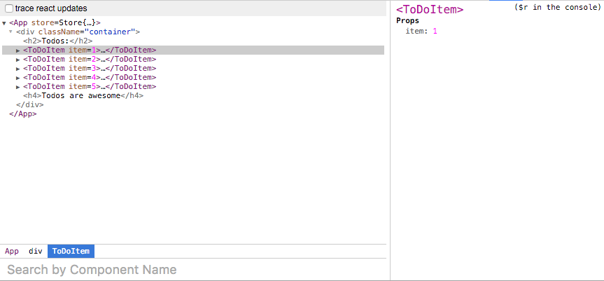

# Hot Module Reloading with Stateless Components

<div id='codefund'></div><div class="re_2020"><a class="re_2020_link" href="https://www.react-europe.org/#slot-2149-workshop-typescript-for-react-and-graphql-devs-with-michel-weststrate" target="_blank" rel="sponsored noopener"><div><div class="re_2020_ad" >Ad</div></div><span>Join the author of MobX at <b>ReactEurope</b> to learn how to use <span class="link">TypeScript with React</span></span></a></div>

One thing that can be a challenge when getting started with MobX (and React in general) is understanding why Hot Module Reloading (HMR) sometimes breaks. When you initially get it working, it seems like magic (and it kind of is), however there's at least one rough edge with regard to HMR and React: stateless components. Since stateless components don't explicitly identify themselves as React components, HMR doesn't quite know what to do with them, and so you'll often see warnings in your console like this:

```
[HMR] The following modules couldn't be hot updated: (Full reload needed)
This is usually because the modules which have changed (and their parents) do not know how to hot reload themselves. See http://webpack.github.io/docs/hot-module-replacement-with-webpack.html for more details.
[HMR]  - ./src/ToDoItem.jsx
```

This is especially apparent when you start working with MobX since observables make it really easy to create a lot of stateless components. Here are some tips for how to build your stateless components and still get all the advantages of HMR:

## Use function declarations instead of arrow functions

Function declarations still do the exact same thing as arrow functions, but they have the key advantage of actually having names inside of the React DevTools.

For instance, here's a stateless component built with an arrow function:

```javascript
const ToDoItem = observer(props => <div>{props.item}</div>)

export default ToDoItem
```

And here's how that will appear in the React DevTools:


On the other hand, using a function declaration will allow you to build the same stateless component AND see it in the DevTools:

```javascript
function ToDoItem(props) {
    return <div>{props.item}</div>
}

export default observer(ToDoItem)
```

And now the component shows up correctly in the DevTools:



## Make sure your top-level component is a stateful observer

By "stateful observer", all I really mean is a component created with `React.Component` or `React.createClass` and which uses the `@observer` decorator, like so:

```javascript
import { observer } from "mobx-react"

@observer
class App extends React.Component {
    constructor(props) {
        super(props)
        this.store = props.store
    }

    render() {
        return (
            <div className="container">
                <h2>Todos:</h2>
                {this.store.todos.map((t, idx) => (
                    <ToDoItem key={idx} item={t} />
                ))}
            </div>
        )
    }
}
```

In this case, `ToDoItem` is stateless, but will still work with HMR because the root-level of the UI tree is a stateful observer. As a result, whenever we change **any** stateless component, it will be hot-reloaded because the observers will trigger computations in the root-level component as well. And since the root-level component is a good old-fashioned React component, it'll trigger the HMR for all of its children and voila! All the magic of stateless components, observables, and hot module reloading working together beautifully.
