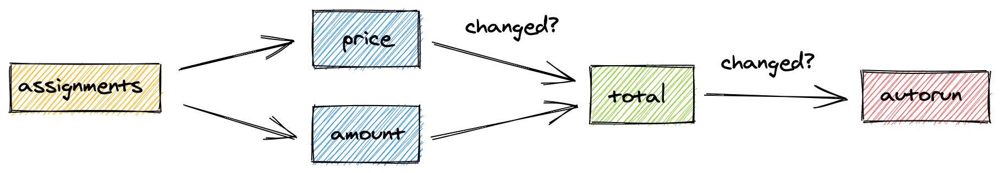

<script async type="text/javascript" src="//cdn.carbonads.com/carbon.js?serve=CEBD4KQ7&placement=mobxjsorg" id="_carbonads_js"></script>

# Deriving information with computeds

Usage:

-   `computed` _(annotation)_
-   `computed(options)` _(annotation)_
-   `computed(fn, options?)`

Computed values can be used to derive information from other observables.
They evaluate lazily, caching their output and only recomputing if one of the underlying observables has changed.
If they are not observed by anything, they suspend entirely.

Conceptually, they are very similar to formulas in spreadsheets, and can't be underestimated. They help in reducing the amount of state you have to store and are highly optimized. Use them wherever possible.

## Example

Computed values can be created by annotating JavaScript [getters](https://developer.mozilla.org/en-US/docs/Web/JavaScript/Reference/Functions/get) with `computed`.
Use `makeObservable` to declare a getter as computed. If you instead want all getters to be automatically declared as `computed`, you can use either `makeAutoObservable`, `observable` or `extendObservable`.

To help illustrate the point of computed values, the example below relies on [`autorun`](reactions.md#autorun) from the [Reactions {🚀}](reactions.md) advanced section.

```javascript
import { makeObservable, observable, computed, autorun } from "mobx"

class OrderLine {
    price = 0
    amount = 1

    constructor(price) {
        makeObservable(this, {
            price: observable,
            amount: observable,
            total: computed
        })
        this.price = price
    }

    get total() {
        console.log("Computing...")
        return this.price * this.amount
    }
}

const order = new OrderLine(0)

const stop = autorun(() => {
    console.log("Total: " + order.total)
})
// Computing...
// Total: 0

console.log(order.total)
// (No recomputing!)
// 0

order.amount = 5
// Computing...
// (No autorun)

order.price = 2
// Computing...
// Total: 10

stop()

order.price = 3
// Neither the computation nor autorun will be recomputed.
```

The above example nicely demonstrates the benefits of a `computed` value, it acts as a caching point.
Even though we change the `amount`, and this will trigger the `total` to recompute,
it won't trigger the `autorun`, as `total` will detect its output hasn't been affected, so there is no need to update the `autorun`.

In comparison, if `total` would not be annotated, the `autorun` would run its effect 3 times,
as it would directly depend on `total` and `amount`. [Try it out yourself](https://codesandbox.io/s/computed-3cjo9?file=/src/index.tsx).



This is the dependency graph that would be created for the above example.

## Rules

When using computed values there are a couple of best practices to follow:

1. They should not have side effects or update other observables.
2. Avoid creating and returning new observables.
3. They should not depend on non-observable values.

## Tips

<details id="computed-suspend"><summary>**Tip:** computed values will be suspended if they are _not_ observed<a href="#computed-suspend" class="tip-anchor"></a></summary>

It sometimes confuses people new to MobX, perhaps used to a library like [Reselect](https://github.com/reduxjs/reselect), that if you create a computed property but don't use it anywhere in a reaction, it is not memoized and appears to be recomputed more often than necessary.
For example, if we extended the above example with calling `console.log(order.total)` twice, after we called `stop()`, the value would be recomputed twice.

This allows MobX to automatically suspend computations that are not actively in use
to avoid unnecessary updates to computed values that are not being accessed. But if a computed property is _not_ in use by some reaction, then computed expressions are evaluated each time their value is requested, so they behave just like a normal property.

If you only fiddle around computed properties might not seem efficient, but when applied in a project that uses `observer`, `autorun`, etc., they become very efficient.

The following code demonstrates the issue:

```javascript
// OrderLine has a computed property `total`.
const line = new OrderLine(2.0)

// If you access `line.total` outside of a reaction, it is recomputed every time.
setInterval(() => {
    console.log(line.total)
}, 60)
```

It can be overridden by setting the annotation with the `keepAlive` option ([try it out yourself](https://codesandbox.io/s/computed-3cjo9?file=/src/index.tsx)) or by creating a no-op `autorun(() => { someObject.someComputed })`, which can be nicely cleaned up later if needed.
Note that both solutions have the risk of creating memory leaks. Changing the default behavior here is an anti-pattern.

MobX can also be configured with the [`computedRequiresReaction`](configuration.md#computedrequiresreaction-boolean) option, to report an error when computeds are accessed outside of a reactive context.

</details>

<details id="computed-setter"><summary>**Tip:** computed values can have setters<a href="#computed-setter" class="tip-anchor"></a></summary>

It is possible to define a [setter](https://developer.mozilla.org/en-US/docs/Web/JavaScript/Reference/Functions/set) for computed values as well. Note that these setters cannot be used to alter the value of the computed property directly,
but they can be used as an "inverse" of the derivation. Setters are automatically marked as actions. For example:

```javascript
class Dimension {
    length = 2

    constructor() {
        makeAutoObservable(this)
    }

    get squared() {
        return this.length * this.length
    }
    set squared(value) {
        this.length = Math.sqrt(value)
    }
}
```

</details>

<details id="computed-struct"><summary>{🚀} **Tip:** `computed.struct` for comparing output structurally <a href="#computed-struct" class="tip-anchor"></a></summary>

If the output of a computed value that is structurally equivalent to the previous computation doesn't need to notify observers, `computed.struct` can be used. It will make a structural comparison first, rather than a reference equality check, before notifying observers. For example:

```javascript
class Box {
    width = 0
    height = 0

    constructor() {
        makeObservable(this, {
            width: observable,
            height: observable,
            topRight: computed.struct
        })
    }

    get topRight() {
        return {
            x: this.width,
            y: this.height
        }
    }
}
```

By default, the output of a `computed` is compared by reference. Since `topRight` in the above example will always produce a new result object, it is never going to be considered equal to a previous output. Unless `computed.struct` is used.

However, in the above example _we actually don't need `computed.struct`_!
Computed values normally only re-evaluate if the backing values change.
That's why `topRight` will only react to changes in `width` or `height`.
Since if any of those change, we would get a different `topRight` coordinate anyway. `computed.struct` would never have a cache hit and be a waste of effort, so we don't need it.

In practice, `computed.struct` is less useful than it sounds. Only use it if changes in the underlying observables can still lead to the same output. For example, if we were rounding the coordinates first, the rounded coordinates might be equal to the previously rounded coordinates even though the underlying values aren't.

Check out the [`equals`](#equals) option for further customizations on determining whether the output has changed.

</details>

<details id="computed-with-args"><summary>{🚀} **Tip:** computed values with arguments<a href="#computed-with-args" class="tip-anchor"></a></summary>

Although getters don't take arguments, several strategies to work with derived values that need arguments are discussed [here](computeds-with-args.md).

</details>

<details id="standalone"><summary>{🚀} **Tip:** create standalone computed values with `computed(expression)`<a href="#standalone" class="tip-anchor"></a></summary>

`computed` can also be invoked directly as a function, just like [`observable.box`](api.md#observablebox) creates a standalone computed value.
Use `.get()` on the returned object to get the current value of the computation.
This form of `computed` is not used very often, but in some cases where you need to pass a "boxed" computed value around it might prove itself useful, one such case is discussed [here](computeds-with-args.md).

</details>

## Options {🚀}

`computed` usually behaves the way you want it to out of the box, but it's possible to customize its behavior by passing in an `options` argument.

### `name`

This string is used as a debug name in the [Spy event listeners](analyzing-reactivity.md#spy) and [MobX developer tools](https://github.com/mobxjs/mobx-devtools).

### `equals`

Set to `comparer.default` by default. It acts as a comparison function for comparing the previous value with the next value. If this function considers the values to be equal, then the observers will not be re-evaluated.

This is useful when working with structural data and types from other libraries. For example, a computed [moment](https://momentjs.com/) instance could use `(a, b) => a.isSame(b)`. `comparer.structural` and `comparer.shallow` come in handy if you want to use structural / shallow comparison to determine whether the new value is different from the previous value, and as a result notify its observers.

Check out the [`computed.struct`](#computed-struct) section above.

#### Built-in comparers

MobX provides four built-in `comparer` methods which should cover most needs of the `equals` option of `computed`:

-   `comparer.identity` uses the identity (`===`) operator to determine if two values are the same.
-   `comparer.default` is the same as `comparer.identity`, but also considers `NaN` to be equal to `NaN`.
-   `comparer.structural` performs deep structural comparison to determine if two values are the same.
-   `comparer.shallow` performs shallow structural comparison to determine if two values are the same.

You can import `comparer` from `mobx` to access these methods. They can be used for `reaction` as well.

### `requiresReaction`

It is recommended to set this one to `true` on very expensive computed values. If you try to read its value outside of the reactive context, in which case it might not be cached, it will cause the computed to throw instead of doing an expensive re-evalution.

### `keepAlive`

This avoids suspending computed values when they are not being observed by anything (see the above explanation). Can potentially create memory leaks, similar to the ones discussed for [reactions](reactions.md#always-dispose-of-reactions).
