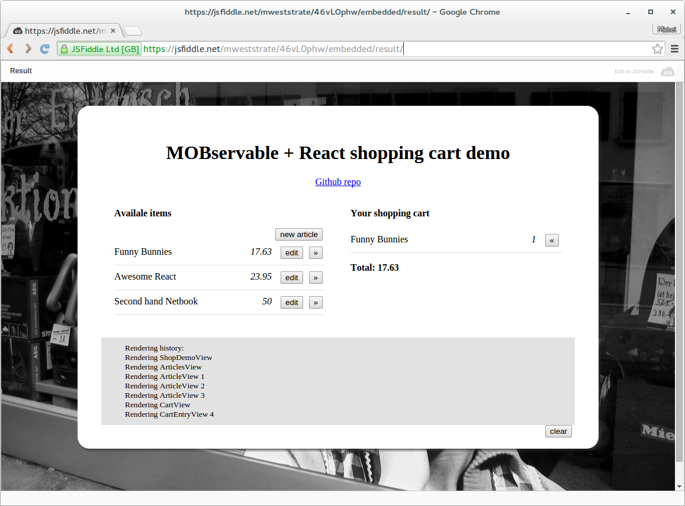
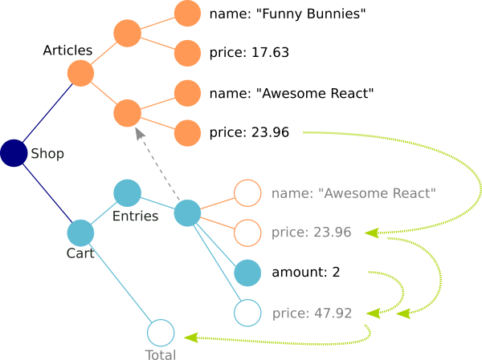
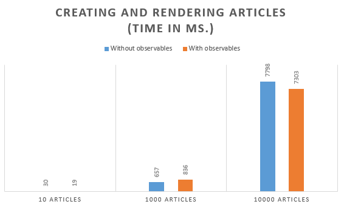
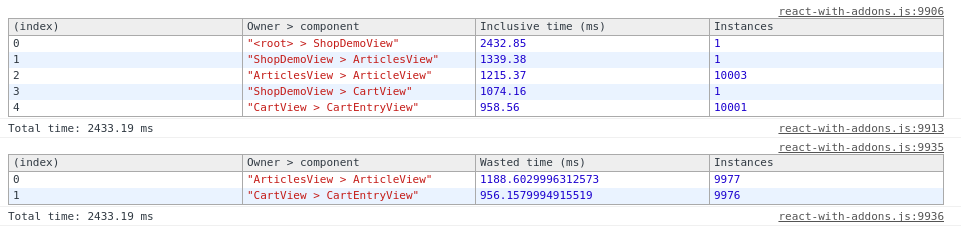
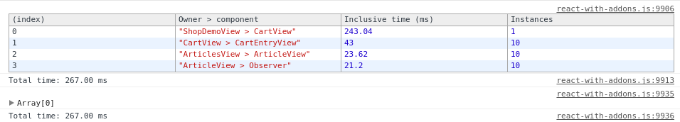

# A Reactive React for building high performance, easy maintainable projects

How to build blazing fast react apps?
Since recently, we started using React in one of our large scale projects and React has helped us big time thanks to its structured way of building components and its fast virtual DOM that saves tons of UI updates.
The beauty of this project is that it has quite some nice challenges; it needs to draw thousands of objects in the browser and these objects are highly coupled to each other. 
Values of one object might be used in an arbitrarily amount of other objects so a small changes might require updates in many unrelated parts of the UI.
These values might be updated by drag and drop actions of the user, so to keep the UI responsive, all updates and repaints have to happen in less then 40 milliseconds.
And although plain React is fast, it didn't took us too long to figure out that just React wouldn't do the job.

So we started searching for a solution that would offer us the needed performance and still allowed our code base maintainable and according to React principles. 
In short, we want an *elegant* solution.
So we tried to leverage a concept from the world of Functional Reactive Programming; namely *Observables*.
The selling point of observables is all computations automatically detect which other observables they use. 
The computation will then be re-evaluated automatically when one of these observables changes in the future.
*Observables* are a concept which are in other UI frameworks as well, such as Ember and Knockout. 
We figured out that if all our model objects become *Observables* and all our React components become *Observers* of the model, 
we don't need to apply any further magic to make sure the relevant part, and only the relevant part, of our UI gets updated.
Read on to see all the awesomeness unrevealed. There are even numbers near the end!

Lets start with a contrived example to make this all a lot less theoretically (or fussy if you prefer). 
Imagine a react app that represents a small shop. There are some articles, and there is a shopping cart in which you can put some of these articles.
Something like this:



Poof, [there](https://jsfiddle.net/mweststrate/46vL0phw/embedded/result/) it is in real life.

## The data model

For starters, lets define the data model. There are articles with a name and price and there is a shopping cart with a total cost, which is based on the sum of its entries. 
Each entry refers to an article, stores an amount and has a derived price. 
The relations within our data model are visualized below. 
Open bullets represent derived date, that should be updated if some other data changes and so should its representation in the UI.
So even in this simple model a lot of data is flowing around, and that a lot of UI updates are required when stuff changes.

 

Lets compile a list of requirements:

* If the price of an article changes, all related shopping cart entries should re-evaluate their price.
* .. and so should the total costs of the cart.
* If the amount of articles in the cart changes, the total costs should be updated.
* If an article is renamed then its view should be updated
* If an article is renamed then the view of related cart entries should be updated
* If a new article is added tot the cart..
* etc.. etc.. 

Probably by now the gist of our UI problems is clear. 
As programmer you don't want to write boiler-plate code to process all kinds of possible updates, 
but your user might have to wait inconveniently long if your application is always re-rendered upon each data change.

So, lets solve this problem for once and for all and write down our data model:

```javascript
function Article(name, price) {
    mobservable.props(this, {
        name: name,
        price: price
    });
}

function ShoppingCartEntry(article) {
    mobservable.props(this, {
        article: article,
        amount: 1,
        price: function() {
            return this.article ? this.article.price * this.amount : 0;
        }
    });
}

function ShoppingCart() {
    mobservable.props(this, {
        entries: [],
        total: function() {
            return this.entries.reduce(function(sum, entry) {
                return sum + entry.price;
            }, 0);
        }
    });
}
```

Ok, that wasn't too hard right? The above constructor functions rely heavily on the [MOBservable](https://github.com/mweststrate/mobservable) library,
which provide a stand-alone implementation of the observable concept (it should combine with other javascript based libraries just as easy as with React). 
The `props` function creates new, observable properties on the target object, based on the provided keys and the types of the values.
Due to the observable nature of all properties, the above functions are automatically (and only) updated when some of its dependencies change.
This immediately fulfills some of our requirements, as, for example, the `total` of the cart is automatically updated when new entries are added, when the price of articles changes etc. 

## The user interface

Seeing is believing, so lets build an user interface around this model. We create some React components that renders our initial data. 
The following JSX snippet shows a view on the shopping cart, renders all entries in the cart and shows the total price of the cart. 
As you can imagine, other components in the app, like the view on articles, are very similar.

```javascript
var CartView = React.createClass({
    render: function() {
        function renderEntry(entry) {
            return (<CartEntryView entry={entry} cart={this.props.cart} key={entry.id} />);
        }
        return (<div>
            <ul id="cart">{this.props.cart.entries.map(renderEntry)}</ul>
            <div><b>Total: <span id="total">{this.props.cart.total}</span></b></div>
        </div>)
    } 
});

var CartEntryView = React.createClass({
    render: function() {
        return (<li>
            <button onClick={this.removeArticle}>&laquo;</button>
            <span>{this.props.entry.article.name}</span>
            <span>{this.props.entry.amount}</span>
        </li>);
    },
    
    removeArticle: function() {
        if (--this.props.entry.amount < 1)
            this.props.cart.entries.splice(this.props.cart.entries.indexOf(this.props.entry), 1);      
    }
}); 
```

Pretty straight forward, right? A CartView component receives a cart, renders its total and its individual items using the CartEntryView, 
which in turn prints the name of the related article and the amount of articles desired. 
According to React best practices, each listed item should be uniquely identifiable, so we assign an arbitrary yet immutable id to each entry.
The remove button drops this amount by one and if it hits zero the entire entry is removed from the cart. 
Note that nowhere in the `removeArticle` function we indicate that the UI should be updated. 

The next big step is forcing those components to stay up to date with the data model, for example when the entry is removed.
As you can determine easily from the rendering code, there are a lot of possible data transitions; the amount of articles can change, the total cart costs can change,
the name of an article can change, even the reference between entry and article can change. How are we gonna listen to all these changes?

Well, that is pretty straight forward. Just add mixin `mobservable.ObserverMixin` to each component and that is enough to settle all our other requirements:

```javascript
var CartEntryView = React.createClass({
    mixins: [mobservable.ObserverMixin, React.addons.Pure-RenderMixin],
    render: function() {
        return (<li>
            // etc...
```

Wait, what, thats all? Yup, just check out the demo and the source of the above at [JSfiddle](https://jsfiddle.net/mweststrate/46vL0phw/).
So what did happen here? The `ObserverMixin` did two things for us. 
First, it turned the render function of the component into an observable function. 
Secondly, the component itself was registered as observer of that function, so that each time the rendering becomes stale a re-rendering is forced.
So this mixin makes sure that whenever observable data is changed, only the relevant parts of the UI are updated. 
Just play around in the example app, and while doing that, keep an eye on the log panel and see how the UI is updated based on your actual actions and the actual data:

* try to rename an article that is not in the shopping cart
* add an article to the cart, then rename it
* add an article to the cart, and update its price
* remove it from the cart, update its price again
* ... etc. You will notice that with each action, the minimum amount of components will be re-rendered.

Finally, since each component tracks its own dependencies, there is usually no need to explicitly re-render the children of a component. 
For example, if the total of the shopping cart is re-rendered, there is no need to re-render the entries as well. React's own *Pure-RenderMixin* makes sure that that doesn't happen.

## The numbers

So what did we achieve? For comparison purposes, [here](https://jsfiddle.net/mweststrate/46vL0phw/) you can find the exact same app but without observables and a naive 're-render-all-the-things' approach.
With only a few articles you won't notice any difference, but once the number of articles is ramped up, the difference in performance becomes really significant.




Creating large amounts of data and components behaves very similar with and without observables.
But once data is changed, the observables really start to shine. 
Updating 10 articles in a collection of 10.000 items is approximately ten times faster! 2.5 seconds dropped to 250 milliseconds. 
That is the difference between a lagging and a non-lagging experience.
Where does this difference come from? 
Lets first take a look at the React render rapports after running the updates in the 'update 10 articles in a list of 1000' scenarios without observables:



As you can see, all twenty thousand ArticleViews and CartEntryViews are re-rendered. However, according to react 2145 of the total of 2433 milliseconds of rendering where wasted.
Wasted means: time that was spent on executing render functions that did not actually result in an update of the real DOM.
This strongly suggests that naively re-rendering everything is a big waste of CPU time if there are many components. 
For comparison, here is the same image with observables:



That is a big difference! Instead of re-rendering 20006 components, only 31 components are re-rendered. And more importantly, there is no waste reported!
That means that each and every re-rendered component actually changed something in the DOM. That is exactly what we intended to achieve by using observables!

## Conclusion

By using observables we built an application that is an order of magnitude faster than the same app that naively re-renders all components.
And as important (for you as a programmer), we did this without compromising the maintainability of the code. 
Just take a look at the source code of the two JSFiddles linked above, the two listings are very similar and are both equally convenient to work with.

Could we have achieved the same with other techniques? Probably. 
For instance there is ImmutableJS which also makes the React rendering very fast by only updating that receive changed data.
However, you have to do much larger concession on your data model. 
After all, imho, mutable classes are in the end a tat more convenient to work with than their immutable counterparts.
(But I strongly advise to still use controllers that alter data, even with observables, to keep the separation of concerns clear).

You can also create events for each possible mutation, and register listeners (and unsubscribe those again!) at the proper moments and in the proper components.
But this results in tons of boiler-plate code which is error-prone to maintain.
Besides, I tend to think I'm just too lazy to do such things.

So for me, I'll gonna leave the hard work to React and Observables, and focus on the interesting parts of coding :).

## Resources

[MOBservable library](https://github.com/mweststrate/mobservable)
[React performance guide](https://facebook.github.io/react/docs/advanced-performance.html)
[Shopping cart demo, React with Observables](https://jsfiddle.net/mweststrate/vxn7qgdw/)
[Shopping cart demo, React without Observables](https://jsfiddle.net/mweststrate/46vL0phw/)
[Shopping cart demo, JQuery with Observables](https://jsfiddle.net/mweststrate/wr2hcdwL)