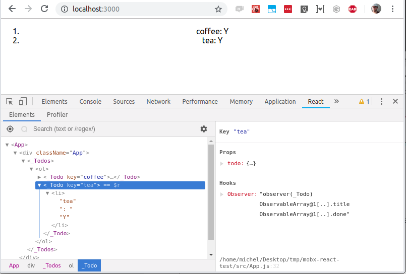

# mobx-react

[](https://circleci.com/gh/mobxjs/mobx-react)
[](https://cdnjs.com/libraries/mobx-react)
[](https://bundlephobia.com/result?p=mobx-react)
[](https://github.com/mobxjs/mobx/discussions)
[](https://changelogs.xyz/mobx-react)

Package with React component wrapper for combining React with MobX.
Exports the `observer` decorator and other utilities.
For documentation, see the [MobX](https://mobx.js.org) project.
This package supports both React and React Native.

## Compatibility matrix

Only the latest version is actively maintained. If you're missing a fix or a feature in older version, consider upgrading or using [patch-package](https://www.npmjs.com/package/patch-package)

| NPM Version | Support MobX version | Supported React versions | Added support for:                                                               |
| ----------- | -------------------- | ------------------------ | -------------------------------------------------------------------------------- |
| v10         | 7.\*                 | >=18                     | MobX 7, Hooks, React 18 strict mode                                              |
| v9          | 6.\*                 | >=18                     | Hooks, React 18 strict mode                                                      |
| v7          | 6.\*                 | >16.8 < 18.2             | Hooks                                                                            |
| v6          | 4.\* / 5.\*          | >16.8 <17                | Hooks                                                                            |
| v5          | 4.\* / 5.\*          | >0.13 <17                | No, but it is possible to use `<Observer>` sections inside hook based components |

`mobx-react` is the canonical React binding package for MobX:

-   Support for function components through `observer`
-   Support for class based components for `observer` and `@observer`

## Installation

`npm install mobx-react --save`

Or CDN: https://unpkg.com/mobx-react (UMD namespace: `mobxReact`)

```javascript
import { observer } from "mobx-react"
```

This package provides the bindings for MobX and React.
See the [official documentation](https://mobx.js.org/react-integration.html) for how to get started.

Use `React.createContext` to pass stores around.

## API documentation

Please check [mobx.js.org](https://mobx.js.org/) for the general documentation. The documentation below highlights some specifics.

### `observer(component)`

Function (and decorator) that converts a React component definition, React component class, or stand-alone render function, into a reactive component. A converted component will track which observables are used by its effective `render` and automatically re-render the component when one of these values changes.

#### Functional Components

`React.memo` is automatically applied to functional components provided to `observer`. `observer` does not accept a functional component already wrapped in `React.memo`, or an `observer`, in order to avoid consequences that might arise as a result of wrapping it twice.

#### Class Components

`shouldComponentUpdate` is not supported. As such, it is recommended that class components extend `React.PureComponent`. The `observer` will automatically patch non-pure class components with an internal implementation of `React.PureComponent` if necessary.

Extending `observer` class components is not supported. Always apply `observer` only on the last class in the inheritance chain.

See the [MobX](https://mobx.js.org/react-integration.html#react-integration) documentation for more details.

```javascript
import { observer } from "mobx-react"

// ---- ES6 syntax ----
const TodoView = observer(
    class TodoView extends React.Component {
        render() {
            return <div>{this.props.todo.title}</div>
        }
    }
)

// ---- ESNext syntax with decorator syntax enabled ----
@observer
class TodoView extends React.Component {
    render() {
        return <div>{this.props.todo.title}</div>
    }
}

// ---- or just use function components: ----
const TodoView = observer(({ todo }) => <div>{todo.title}</div>)
```

##### Note on using props and state in derivations

`mobx-react` version 6 and lower would automatically turn `this.state` and `this.props` into observables.
This has the benefit that computed properties and reactions were able to observe those.
However, since this pattern is fundamentally incompatible with `StrictMode` in React 18.2 and higher, this behavior has been removed in React 18.

As a result, we recommend to no longer mark properties as `@computed` in observer components if they depend on `this.state` or `this.props`.

```javascript
@observer
class Doubler extends React.Component<{ counter: number }> {
    @computed // BROKEN! <-- @computed should be removed in mobx-react > 7
    get doubleValue() {
        // Changes to this.props will no longer be detected properly, to fix it,
        // remove the @computed annotation.
        return this.props * 2
    }

    render() {
        return <div>{this.doubleValue}</div>
    }
}
```

Similarly, reactions will no longer respond to `this.state` / `this.props`. This can be overcome by creating an observable copy:

```javascript
@observer
class Alerter extends React.Component<{ counter: number }> {
    @observable observableCounter: number
    reactionDisposer

    constructor(props) {
        this.observableCounter = counter
    }

    componentDidMount() {
        // set up a reaction, by observing the observable,
        // rather than the prop which is non-reactive:
        this.reactionDisposer = autorun(() => {
            if (this.observableCounter > 10) {
                alert("Reached 10!")
            }
        })
    }

    componentDidUpdate() {
        // sync the observable from props
        this.observableCounter = this.props.counter
    }

    componentWillUnmount() {
        this.reactionDisposer()
    }

    render() {
        return <div>{this.props.counter}</div>
    }
}
```

MobX-react will try to detect cases where `this.props`, `this.state` or `this.context` are used by any other derivation than the `render` method of the owning component and throw.
This is to make sure that neither computed properties, nor reactions, nor other components accidentally rely on those fields to be reactive.

This includes cases where a render callback is passed to a child, that will read from the props or state of a parent component.
As a result, passing a function that might later read a property of a parent in a reactive context will throw as well.
Instead, when using a callback function that is being passed to an `observer` based child, the capture should be captured locally first:

```javascript
@observer
class ChildWrapper extends React.Component<{ counter: number }> {
    render() {
        // Collapsible is an observer component that should respond to this.counter,
        // if it is expanded

        // BAD:
        return <Collapsible onRenderContent={() => <h1>{this.props.counter}</h1>} />

        // GOOD: (causes to pass down a fresh callback whenever counter changes,
        // that doesn't depend on its parents props)
        const counter = this.props.counter
        return <Collapsible onRenderContent={() => <h1>{counter}</h1>} />
    }
}
```

### `Observer`

`Observer` is a React component, which applies `observer` to an anonymous region in your component.
It takes as children a single, argumentless function which should return exactly one React component.
The rendering in the function will be tracked and automatically re-rendered when needed.
This can come in handy when needing to pass render function to external components (for example the React Native listview), or if you
dislike the `observer` decorator / function.

```javascript
class App extends React.Component {
    render() {
        return (
            <div>
                {this.props.person.name}
                <Observer>{() => <div>{this.props.person.name}</div>}</Observer>
            </div>
        )
    }
}

const person = observable({ name: "John" })

ReactDOM.render(<App person={person} />, document.body)
person.name = "Mike" // will cause the Observer region to re-render
```

In case you are a fan of render props, you can use that instead of children. Be advised, that you cannot use both approaches at once, children have a precedence.
Example

```javascript
class App extends React.Component {
    render() {
        return (
            <div>
                {this.props.person.name}
                <Observer render={() => <div>{this.props.person.name}</div>} />
            </div>
        )
    }
}

const person = observable({ name: "John" })

ReactDOM.render(<App person={person} />, document.body)
person.name = "Mike" // will cause the Observer region to re-render
```

### `useLocalObservable` hook

Local observable state can be introduced by using the `useLocalObservable` hook, that runs once to create an observable store. A quick example would be:

```javascript
import { useLocalObservable, Observer } from "mobx-react"

const Todo = () => {
    const todo = useLocalObservable(() => ({
        title: "Test",
        done: true,
        toggle() {
            this.done = !this.done
        }
    }))

    return (
        <Observer>
            {() => (
                <h1 onClick={todo.toggle}>
                    {todo.title} {todo.done ? "[DONE]" : "[OPEN]"}
                </h1>
            )}
        </Observer>
    )
}
```

When using `useLocalObservable`, all properties of the returned object will be made observable automatically, getters will be turned into computed properties, and methods will be bound to the store and apply mobx transactions automatically. If new class instances are returned from the initializer, they will be kept as is.

It is important to realize that the store is created only once! It is not possible to specify dependencies to force re-creation, _nor should you directly be referring to props for the initializer function_, as changes in those won't propagate.

Instead, if your store needs to refer to props (or `useState` based local state), sync those values into the store with `useEffect`.

Note that in many cases it is possible to extract the initializer function to a function outside the component definition. Which makes it possible to test the store itself in a more straight-forward manner, and avoids creating the initializer closure on each re-render.

_Note: using `useLocalObservable` is mostly beneficial for really complex local state, or to obtain more uniform code base. Note that using a local store might conflict with future React features like concurrent rendering._

### Server Side Rendering with `enableStaticRendering`

When using server side rendering, normal lifecycle hooks of React components are not fired, as the components are rendered only once.
Since components are never unmounted, `observer` components would in this case leak memory when being rendered server side.
To avoid leaking memory, call `enableStaticRendering(true)` when using server side rendering.

```javascript
import { enableStaticRendering } from "mobx-react"

enableStaticRendering(true)
```

This makes sure the component won't try to react to any future data changes.

### Which components should be marked with `observer`?

The simple rule of thumb is: _all components that render observable data_.
If you don't want to mark a component as observer, for example to reduce the dependencies of a generic component package, make sure you only pass it plain data.

### Enabling decorators (optional)

Decorators are currently a stage-2 ESNext feature. How to enable them is documented [here](https://mobx.js.org/enabling-decorators.html#enabling-decorators-).

### Should I still use smart and dumb components?

See this [thread](https://www.reddit.com/r/reactjs/comments/4vnxg5/free_eggheadio_course_learn_mobx_react_in_30/d61oh0l).
TL;DR: the conceptual distinction makes a lot of sense when using MobX as well, but use `observer` on all components.

## DevTools

`mobx-react@6` and higher are no longer compatible with the mobx-react-devtools.
That is, the MobX react devtools will no longer show render timings or dependency trees of the component.
The reason is that the standard React devtools are also capable of highlighting re-rendering components.
And the dependency tree of a component can now be inspected by the standard devtools as well, as shown in the image below:



## FAQ

**Should I use `observer` for each component?**

You should use `observer` on every component that displays observable data.
Even the small ones. `observer` allows components to render independently from their parent and in general this means that
the more you use `observer`, the better the performance become.
The overhead of `observer` itself is negligible.
See also [Do child components need `@observer`?](https://github.com/mobxjs/mobx/issues/101)

**I see React warnings about `forceUpdate` / `setState` from React**

The following warning will appear if you trigger a re-rendering between instantiating and rendering a component:

```

Warning: forceUpdate(...): Cannot update during an existing state transition (such as within `render`). Render methods should be a pure function of props and state.`

```

-- or --

```

Warning: setState(...): Cannot update during an existing state transition (such as within `render` or another component's constructor). Render methods should be a pure function of props and state; constructor side-effects are an anti-pattern, but can be moved to `componentWillMount`.

```

Usually this means that (another) component is trying to modify observables used by this components in their `constructor` or `getInitialState` methods.
This violates the React Lifecycle, `componentWillMount` should be used instead if state needs to be modified before mounting.
