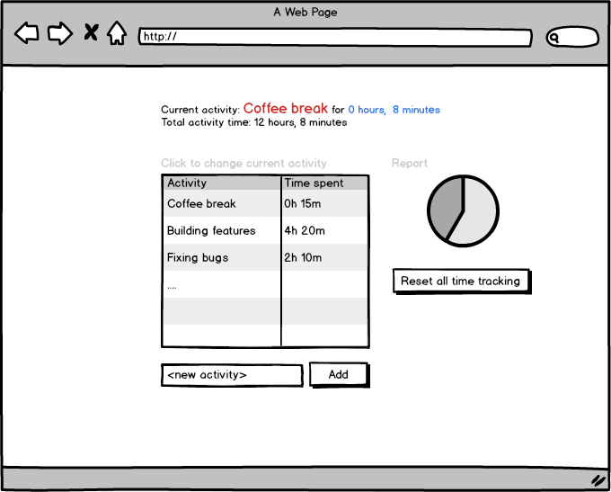

The Average Joe Tutorial For Building Reactive React Apps

react.lib.keyMirror

HowTo: write your first really reactive react app

Hi all, welcome to the reactive react tutorial. In this tutorial you will learn two things.
First: how to build an app using Reactjs and discovering why it is awesome.
Secondly: how to build a react app using Mobservable, and discovering how that [USPs]

In this tutorial you won't be building an todo applications. You probably did that already in any other tutorial you ever followed.
Instead, we will be building a time tracker app. Billable hours are great after all (*if* you are on the receiving side).
Since, like usual, the requirements are incomplete, we will try to start as quickly as possible, based on some JSON mock data and a simple wireframe that was provided by an UX-er with a lack of time. That is, you just get a static image. So here you go, the requirements:

# Stage -1: Application Requirements

The screenshot:



The data: 

```javascript
{
	activities: [
		{
			title: "Coffee break or lunch",
			timeSpent: 0
		},
		{
			title: "Working on feature",
			timeSpent: 0
		},
		{
			title: "Bug fixing",
			timeSpent: 0
		},
		{}
			title: "Scrum meetings",
			timeSpent: 0
		},
		{
			title: "Design discussions",
			timeSpent: 0
		},
		{
			title: "Research / reading blogs",
			timeSpent: 0
		},
		{
			title: "Other",
			timeSpent: 0
		}
	]
}
``` 

Obviously, this isn't really specced out properly. So lets start with implementing the above information and build a static application.
Just to be able to discover that you built something that isn't the thing the stakeholders have in mind >:). (The story of our lives, isn't it).

# Stage 0: Set up the project

Let's start with building a static project that uses React. If you are familiar with React already and not trying to follow this tutorial in all its details, you can safely continue to [stage 2](TODO) This is the kind of scaffolding you probably don't want to do initially yourselves, so lets reuse some existing starters project that provides us with the following:

* Reactjs[link], because: well that is the thing we are trying atm.
* JSX compilation[link]: Provides a convenient syntax to create HTML and components in javascript files
* ES2015[link]: Provides improved JavaScript syntax, like arrow functions and a more convenient module system
* WebPack[link]: So that we can nicely bundle all our javascript files and dependencies into a single file
* Hot Reloading[link]: Conviniently reload your application in the browser whener a file a is saved during development

If you have your own setup to create such a file, that is fine, just proceed to [Stage 1]. 
Otherwise, open a terminal in a *new, empty* directory and clone the `react-hot-boilerplate` project as created by Dan Abramov (thanks for that!). The second line makes sure we create our own repo, with our own history.

```bash
git clone https://github.com/gaearon/react-hot-boilerplate.git .
rm -rf .git && git init && git add . && git commit -m "initial setup"
npm install
npm start
```

Now a webserver has been started that serves your fresh project, and is reloaded whenever you change a file. Now point your browser at `http://localhost:3000`. It should say "Hello, world."

So where does this friendly, inspiring and original greeting come from? The `npm start` command started a development server which serves `index.html`. That file in itself isn't very interesting, it contains a `div` with the id `root`, and loads `bundle.js`. The JavaScript bundle is generated from the sources in the `src` folder. In that folder we find `index.js`, which creates a new `<App>` component and renders it into the earlier mentioned root div.

Time for a boring intermezzo. Just skip this paragraph if have some knowledge of React already. Components are the conceptual core of React, and represent the view on a logical unit of your applications. A component has at least a render function, which describes the (DOM) structure that should be rendered. Components can be nested so that they can form trees. Components can be configured using properties (called "props") and might have state. State is a purely internal concept of a component and cannot be altered from outside the component. Changing the state of a component signal React to re-render a component. Ok, I most probably totally lost you by now. It becomes a lot more clear when we just start to write some actual code.

# Stage 1: Build a static mockup

The easiest way to start building our app is to just build a completely static application. That way UX-ers can start with the styling of the application as soon as possible and our product manager can give a nice 'look, its almost done!' presentation. To make sure the example data is available in our app, we create a new file `stores.js` in the `src` folder with the following contents:

```javascript
TODO
```

http://www.chartjs.org/ + https://github.com/jhudson8/react-chartjs